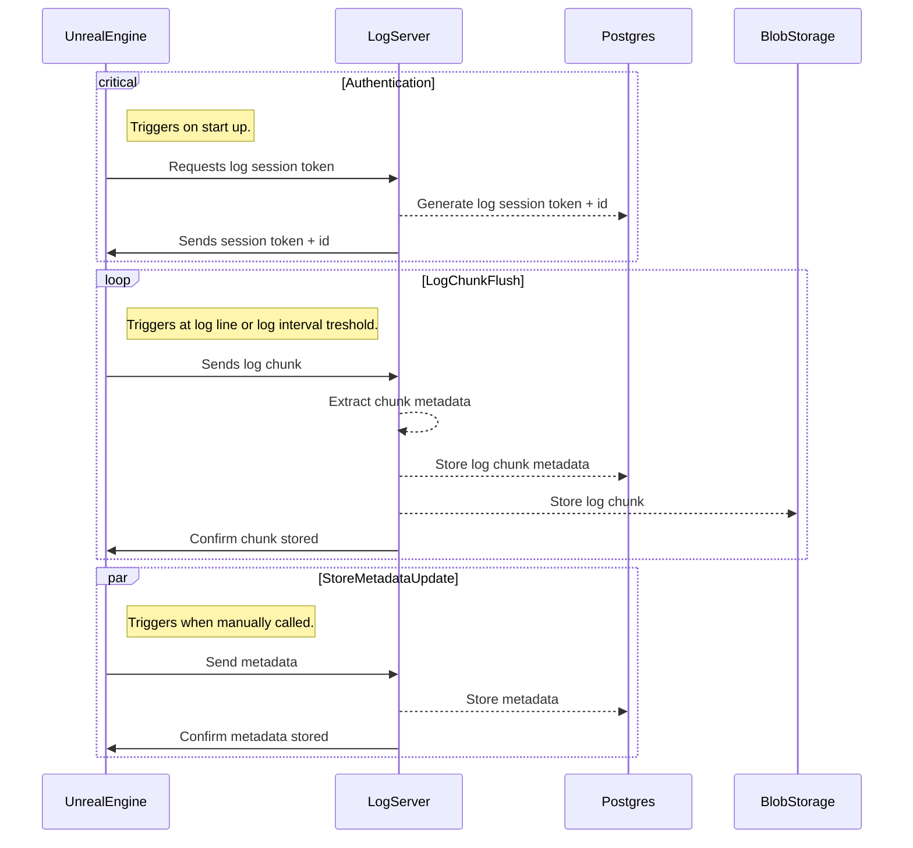

# Logs protocol



## Log format

Capsa logs can only be processed correctly when they are sent in the right format. This is done automatically by the Capsa Unreal Engine plugin.

Format for a log line is, with values placed in `<>`:

```log
[<Timestamp>][<Severity>][<Category>]: <LogContents>
```

Where the log lines are separated by a `\n` character, so we use LF line endings, also when running on Widnows. The Capsa plugin handles this automatically. A log chunk needs to contain a `\n` character after the last line as well.

There should be no whitespace or other characters until the `:` character.

### Log value format

The values of the log are as follows:

| Field           | Format                 | Notes                                                                                                                                                                          |
| --------------- | ---------------------- | ------------------------------------------------------------------------------------------------------------------------------------------------------------------------------ |
| `<Timestamp>`   | `YYYY.MM.DD-HH.MM.mmm` | In [Go time format](https://go.dev/src/time/format.go): `2006.01.02-15.04.05.000`                                                                                              |
| `<Severity>`    | `string`               | In theory, any string should work, but officially, we only support `Fatal`, `Error`, `Warning`, `Log`, `Display`, `Verbose`, `VeryVerbose`                                     |
| `<Category>`    | `string`               | In theory, any string should work, but we advice to use no whitespaces, starting with a capital letter, preferably with the `Log` prefix, following Unreal Engine conventions. |
| `<LogContents>` | `string`               | If the contents contain a `\n`, the rest of the line will be seen as a new line, which will be saved but not processed.                                                        |

For more info about log processing, see [Log processing](./log-processing.md).

## API endpoints for storing logs

### `POST /api/logs/auth`

#### Headers:

```
X-Capsa-Plugin-Version: "v[semver]" (optional)
```

#### Body:

```json
{
  "key": "UUID, read from Unreal Engine .ini config",
  "platform": "string, fe: Win64_Editor",
  "type": "string, Server|Client"
}
```

#### Response (201):

```json
{
  "token": "string, JWT token used for sending data",
  "log_id": "uuid, identifies this log session",
  "link_web": "string, generated link to view the log online",
  "expiry": "string, ISO 8601 timestamp, when the log session expires"
}
```

#### Response (non 2xx):

```json
{
  "error": "string, always set, contains the error",
  "details": "string|omitted if empty, contains additional details if applicable",
  "raw_error": "string|omitted if empty, raw server error, omitted in server non-dev mode"
}
```

---

### `POST /api/logs/metadata`

#### Headers:

```
Authentication: "Bearer <JWT>"
X-Capsa-Plugin-Version: "v[semver]" (optional)
```

#### Body:

Links or metadata can be empty, but not both
The additional metadata is stored with the timestamp of when the metadata was stored to the database.

```json
{
  "loglinks": {
    "uuid of linked log": "description"
  },
  "additionalMetadata": {
    "string key": "string value"
  }
}
```

#### Response (201):

No response body.

#### Response (non 2xx):

```json
{
  "error": "string, always set, contains the error",
  "details": "string|omitted if empty, contains additional details if applicable",
  "raw_error": "string|omitted if empty, raw server error, omitted in server non-dev mode"
}
```

---

### `POST /api/logs/chunk`

#### Headers:

```
Authentication: "Bearer <JWT>"
Content-Type: "text/plain" | "application/gzip"
X-Capsa-Plugin-Version: "v[semver]" (optional)
```

#### Body: log according to compression type

To ensure the correct order of chunks stored, new chunks should not be sent before the old chunks have been confirmed to be stored by the server. Ordering is done one when logs were added, not based on timestamp, in case timestamps are not present in the log.

#### Response (201):

No response body.

#### Response (304):

No response body, sent if the log is shorter than 10 characters total.

#### Response (non 2xx):

```json
{
  "error": "string, always set, contains the error",
  "details": "string|omitted if empty, contains additional details if applicable",
  "raw_error": "string|omitted if empty, raw server error, omitted in server non-dev mode"
}
```
