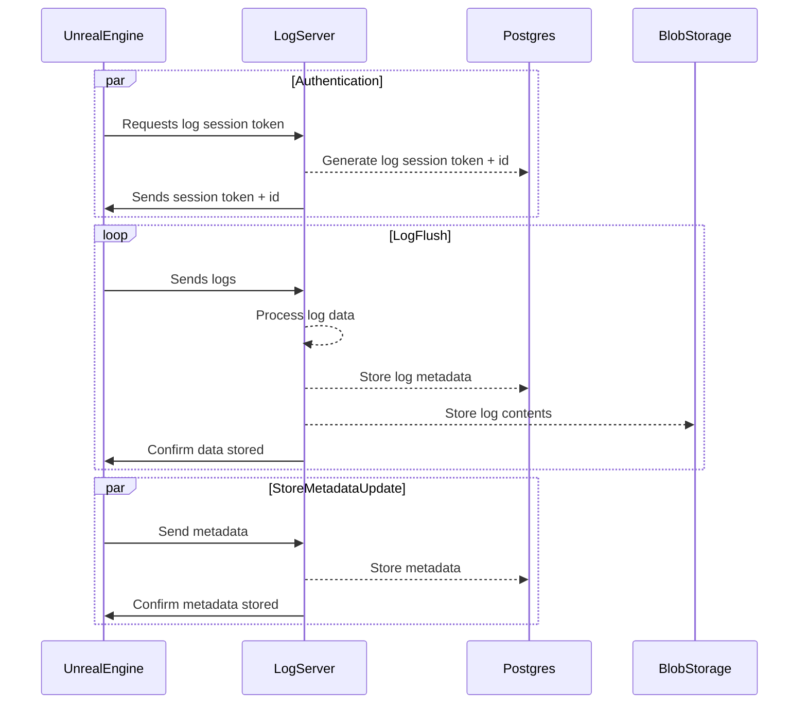

# Protocol



## API endpoints for storing logs

## POST `/api/logs/auth`

Headers:

```
X-Capsa-Plugin-Version: [version]
```

Body: (TODO: more fields)

```json
{
  "key": "key from config",
  "platform": "platform",
  "type": "Server|Client|TODO: more?"
}
```

Response (201):

```json
{
  "token": "token",
  "log_id": "logid",
  "link_web": "direct link to online log",
  "expiry": "timestamp when the log session expires"
}
```

## POST `/api/logs/metadata`

Headers:

```
Authentication: Bearer [token]
X-Capsa-Plugin-Version: [version]
```

Body: (TODO: define fields for connected server etc.)
Links or metadata can be empty, but not both
The additional metadata is stored with the timestamp of when the metadata was stored to the database.

```json
{
  "loglinks": {
    "logid": "description"
  },
  "additionalMetadata": {
    "key": "value"
  }
}
```

Response (201)

## POST `/api/logs/chunk`

Headers:

```
Authentication: Bearer [token]
X-Capsa-Plugin-Version: [version]
X-Compression-Type: "none|type"
```

Body: log according to compression type

To ensure the correct order of chunks stored, new chunks should not be sent before the old chunks have been confirmed to be stored by the server. Ordering is done one when logs were added, not based on timestamp, in case timestamps are not present in the log.

Response (201, 304)
