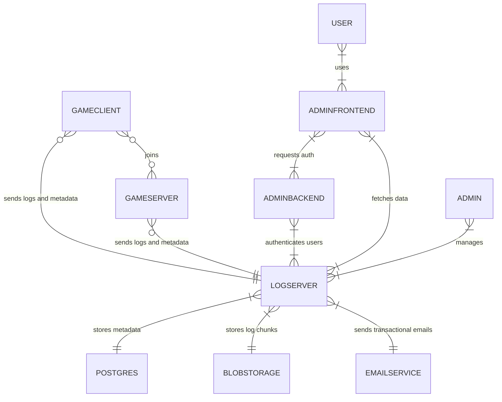

# Systems

The various sytems making up the Capsa application and terminology used in the documentation.

```mermaid
erDiagram
    GAMECLIENT }o--|| LOGSERVER : "sends logs and metadata"
    GAMECLIENT }o--o{ GAMESERVER : "joins"
    GAMESERVER }o--|| LOGSERVER : "sends logs and metadata"


	LOGSERVER }|--|| POSTGRES : "stores metadata"
	LOGSERVER }|--|| BLOBSTORAGE : "stores log chunks"
	LOGSERVER }|--|| EMAILSERVICE : "sends transactional emails"

	ADMINBACKEND }|--|{ LOGSERVER : "authenticates users"
	ADMINFRONTEND }|--|{ ADMINBACKEND : "requests auth"
	ADMINFRONTEND }|--|{ LOGSERVER : "fetches data"

	USER }|--|{ ADMINFRONTEND : "uses"
	ADMIN }|--|{ LOGSERVER : "manages"

```
